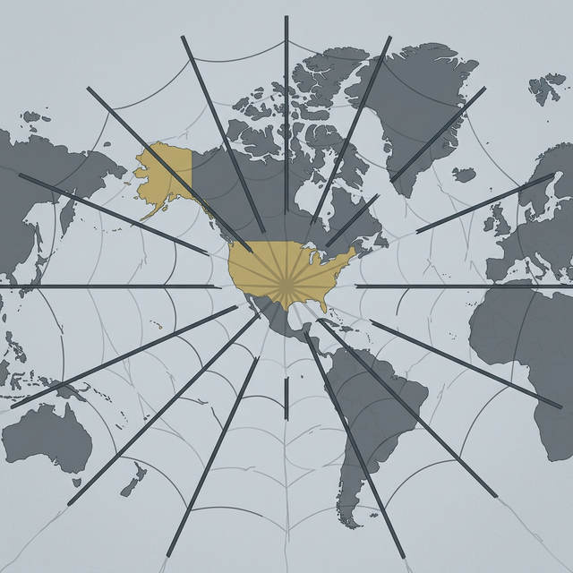

# Seventy Years of Trust, Gone in Twelve Months
### The United States spent seventy years building the most powerful alliance network in human history. Donald Trump has dismantled it in one year—and the real damage isn't to treaties, it's to trust

There is a thought experiment I keep returning to.

Imagine you spent thirty years building a business. You nurtured relationships with suppliers, earned the loyalty of customers, became the anchor of a professional network that trusted your word. Then you handed the keys to someone who, in twelve months, insulted every supplier, threatened every customer, broke every handshake deal, and told the world that loyalty was for suckers.

The buildings would still be standing. The contracts might still be on file. But the business would be dead—because the thing that made it work was never the infrastructure. It was trust.

That is what has happened to the United States and its global alliance network.

## What Seventy Years Built

The system of alliances that America constructed after 1945 was, by any measure, the most successful diplomatic architecture in human history.

NATO bound thirty-two nations into a collective defense pact that kept the peace in Europe for three generations. The US-Japan Security Treaty transformed a wartime enemy into the anchor of Pacific stability. ANZUS, the US-South Korea alliance, bilateral agreements across the Middle East and Southeast Asia—together they created an interlocking web of commitments that allowed the United States to project influence across every continent without needing to project force.

The sheer scale of it was extraordinary. No empire, no kingdom, no civilization has ever assembled anything comparable. Not Rome, not the British Empire, not the Soviets. The Americans didn't just build the biggest alliance network—they built the *only* global alliance network.

And it worked. Not perfectly, not without cost, and certainly not without hypocrisy. But it worked. It deterred great-power war, facilitated the most dramatic period of global economic growth in recorded history, and created a framework in which even nations that disagreed with American policy still showed up to the table, because the alternative—a world without that framework—was worse.

## What Held It Together

The mechanics were treaties, bases, trade agreements, and institutional memberships. But the glue—the thing that made thirty-two nations agree to Article 5, that made Japan host fifty thousand American troops, that made dozens of countries align their foreign policy with Washington's preferences—was **trust.**

Not trust in the sense of naïve belief. Trust in the engineering sense: the reasonable expectation, built on decades of evidence, that the United States would honor its commitments. That it would show up when called. That its word meant something. That the framework, however imperfect, was durable.

This trust was not cheap. It was purchased with Marshall Plan dollars and Korean War casualties and decades of stationed troops and patient, grinding diplomatic work by thousands of people who understood that alliances are not transactions—they are relationships. Relationships that compound over time, like interest, and collapse suddenly, like banks.

## What One Year Destroyed

Donald Trump did not just withdraw from agreements. He made it clear—repeatedly, publicly, gleefully—that he viewed every alliance as a protection racket and every ally as a freeloader.

He threatened to abandon NATO allies who hadn't met spending targets, treating a seventy-year collective security commitment as an unpaid invoice. He imposed tariffs on Canada—America's closest ally, largest trading partner, and the country that invoked Article 5 for the *only* time in NATO history, on behalf of the United States after 9/11—and called it a national security threat. He publicly humiliated allied leaders, sided with adversaries over intelligence agencies, and treated diplomatic relationships as personal leverage opportunities.

In twelve months, the message landed everywhere simultaneously: **the United States cannot be relied upon.**

Not "the United States is a tough negotiator." Not "the United States drives a hard bargain." The message was categorical: the commitments that your country has built its security architecture around for decades are not worth the paper they are written on, because the person holding the pen does not believe in commitments.

## Why Trust Is Different From Everything Else

Here is the part that the transactional worldview cannot grasp: trust is not a commodity. You cannot withdraw it, spend it down, and then buy it back when you need it.

Trust operates on a ratchet. It builds slowly—over years, over decades, through consistent behavior—and it collapses instantly. The asymmetry is brutal. Thirty years of reliable behavior creates a trust reserve. One spectacular betrayal empties it. And the rebuild doesn't start from where you fell—it starts from below where you began, because now there is a data point that says: *this is what they do when it suits them.*

Every allied nation is now doing the same calculation, whether they say it publicly or not: *If the United States did this once, it can do it again. If a single election can transform the most powerful country on earth from a reliable partner into an unpredictable adversary, then our security architecture cannot depend on American reliability.*

This is not a partisan observation. It is a structural one. The damage is not to a particular policy or a particular alliance. The damage is to the **decision-making framework** that every allied government uses when choosing where to invest its security, its trade relationships, and its diplomatic capital.

## What Comes After

The allied nations are not sitting still. They are building alternatives.

Europe is accelerating defense integration at a pace that would have been unthinkable five years ago. Japan is remilitarizing. South Korea is hedging. Canada is diversifying its trade relationships. Australia is deepening ties with India. The Middle Powers coalition—the EU, CPTPP nations, and their affiliates—is beginning to coalesce into something that looks less like a loose grouping and more like a counterweight.

None of this is happening because these nations *want* to decouple from the United States. It is happening because they now *must plan for a world in which the United States is unreliable.* That is the definition of broken trust: not that you choose to leave, but that you are forced to build a backup because you can no longer afford to depend on someone who has demonstrated they will let you down.

The irony is staggering. The administration's stated goal is to make America stronger. But the direct, measurable consequence of its actions is that every ally is now investing in reducing its dependence on America. The alliances are not being strengthened—they are being replaced. The influence is not being preserved—it is being forfeited. And the trust is not being renegotiated—it is being written off.

It hasn't taken long for the chickens to come home to roost. Donald Trump is currently asking for help from (former) allies to re-open the Strait of Hormuz, even as his administration and Netanyahu continue to fuel the crisis and Iranian resistance by bombing Iran on a daily basis.

So far, all of those prior allies and related stakeholders are refusing to help. In the past, many or most would have contributed something to aid the United States. But that help doesn't seem to be forthcoming now that Trump has systematically betrayed their trust across so many issues. The bill for a transactional foreign policy is coming due, and it turns out, no one is willing to extend the United States credit.

## The Engineering Lesson

I have worked in business for nearly 50 years. In my experience, trust is infrastructure—as critical as any database or matching algorithm. You can build a technically perfect product or marketplace, but if participants don't trust the system, no one shows up. And if they show up and trust is betrayed, they don't come back. They build their own system. They route around you.

That is exactly what is happening to the United States on the world stage.

Seventy years of trust, built by generations of diplomats, soldiers, and ordinary people who believed that commitments matter. Gone in twelve months, dismantled by someone who thinks loyalty is a sucker's game.

The buildings are still standing. The treaties are still on file. But the business is dying.

What is your experience with managing systems that depend entirely on trust? Have you seen similar "ratchet effects" when that trust is broken? I'd love to hear your take.

*Vic Uzumeri writes about market design, technology, and the craft of engineering useful systems. Subscribe at vicuzumeri.substack.com.*

---
**Substack Tags:** opinion, trade, strategy, leadership, canada
