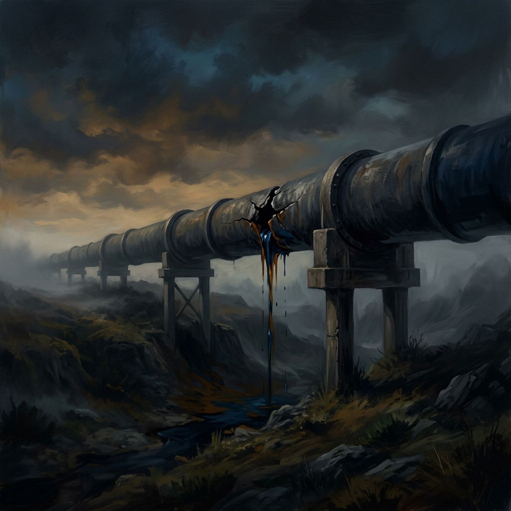

<!--Copyright (c) 2026 Mustafa Uzumeri. All rights reserved.-->

# The Slow Wreck

### When feedback is delayed, the connection between cause and consequence disappears — and leaders keep making decisions as if the damage isn't real

Everybody saw the tariffs. Everybody saw the sanctions. The Strait of Hormuz closing was on every screen for a week.

What almost nobody sees is what happens next — because what happens next takes months.

This is the most dangerous feature of global supply chains in a crisis: the time between a shock and its consequences is long enough that most people, including many national leaders, lose the thread entirely. The cause is dramatic and visible. The effect is slow, diffuse, and arrives after the news cycle has moved on. By the time the shelves thin or the prices spike or the factory closes, the original decision that caused it has been buried under six layers of newer headlines.

Operations managers have a name for this gap. We call it the **feedback time constant** — the delay between an input to a system and the moment when the system's response becomes visible. In a short supply chain, the time constant might be days. In a global supply chain — one that routes raw materials through three continents, six ports, and a dozen intermediaries before reaching a consumer — the time constant is measured in weeks or months.

And that delay changes everything about how decisions get made.

## Little's Law and the Invisible Pipeline

There is a theorem in operations management so fundamental that it is rarely even debated. It is called **Little's Law**, and it says:

> **Inventory = Throughput × Flow Time**

That's it. Three variables. The amount of stuff in a pipeline equals the rate at which stuff moves through it, multiplied by how long each unit spends in transit. It is a mathematical identity — true for any stable system, from a factory floor to a shipping lane to an entire economy's import chain.

The implications for 2026 are stark.

When you impose sanctions on Russian oil, you don't see the effect tomorrow. The oil that was already in tankers, in pipelines, in storage terminals, in refinery queues — all of that keeps flowing. The pipeline has weeks or months of inventory in it. Little's Law guarantees that the visible impact will be delayed by an amount of time proportional to how much stuff was already in the pipe when you turned the valve.

The same is true for tariffs. When the United States imposes a 25% tariff on a category of Chinese goods, the container ships already at sea arrive at the old price. The inventory already in American warehouses sells at the old price. The contracts already signed execute at the old price. The new price — the real price, the one that reflects the tariff — doesn't show up on store shelves for weeks or months. By then, the political conversation has moved on to something else entirely.

And when the Strait of Hormuz closes? Twenty percent of the world's oil passes through a channel 33 kilometers wide. But petroleum supply chains have buffer stocks — strategic reserves, commercial inventories, tankers in transit. Those buffers absorb the first weeks of disruption. The crisis doesn't look like a crisis yet. It looks like a news story that came and went.

## The Deadly Disconnect

This is where the real damage happens — not in the supply chain itself, but in the decision-making process that governs it.

When feedback is delayed, human beings are systematically terrible at connecting cause to effect. This is not a character flaw. It is a well-documented cognitive limitation. We are wired to understand immediate consequences: touch a hot stove, burn your hand. We are poorly equipped to understand consequences that arrive weeks or months after the action that caused them.

In a national policy context, this creates a deadly disconnect:

**The leader who imposes the tariff gets the political benefit immediately** — the announcement, the rally, the appearance of strength. **The economic pain arrives later**, distributed across thousands of businesses, millions of consumers, in forms that are hard to trace back to the original decision. Price increases get blamed on "greedflation." Factory closures get blamed on automation. Supply shortages get blamed on foreign governments. The feedback never completes the loop.

**The leader who imposes sanctions sees the diplomatic signal instantly** — the target country is "punished." **Whether the sanctions actually change the target's behavior** takes months or years to evaluate, by which time the sanctions have become part of the background furniture of policy. Nobody revisits whether they worked. The feedback loop is never closed.

**The military planner who closes a shipping lane** sees the immediate tactical advantage. **The cascade through energy markets, petrochemical supply chains, fertilizer production, food prices, and eventual civil unrest** unfolds over a timeline too long for any single briefing to capture. Each link in the chain is someone else's problem.

## The Bullwhip Nobody Talks About

Supply chain professionals know about the **bullwhip effect** — the phenomenon where small fluctuations in end-consumer demand get amplified as they propagate upstream through a supply chain. A 5% dip in retail sales can produce a 40% swing in raw material orders four tiers back.

What is happening in 2026 is a bullwhip in reverse — massive, deliberate shocks applied at the upstream end of global supply chains, propagating downstream through buffers and pipelines, arriving at consumers weeks or months later in forms that are difficult to attribute.

Sanctions on Russian energy. Sanctions on Iranian oil. Tariffs on Chinese manufacturing. Closure of the Strait of Hormuz. Each of these is a sledgehammer blow to the input end of supply chains that feed billions of people.

The buffers are absorbing the blows right now. That is what buffers are for. But buffers deplete. Little's Law is patient and arithmetic. When the pipeline inventory is consumed and no new supply is flowing in to replace it, the effects will arrive — not as a gentle correction, but as a cliff.

We saw this with COVID. The supply chain shocks of early 2020 didn't fully manifest until late 2020 and into 2021. By the time the chip shortage hit auto manufacturing, most people had forgotten that a virus in Wuhan had anything to do with it. The feedback time constant was nine to twelve months. The connection between cause and effect was invisible to almost everyone outside the industry.

## What the Attentive See

The people who understand time constants — supply chain professionals, commodity traders, logistics planners — are already watching the dashboards. They can see the buffer levels declining. They can see shipping patterns rerouting. They can see order books thinning. They can calculate, roughly, when the pipeline inventory runs out and the real shortages begin.

But these people do not set national policy. The people who set national policy are operating on a feedback loop measured in news cycles and polling data — hours and days, not weeks and months. They are structurally incapable of seeing the slow wreck they are engineering, because the wreck hasn't happened yet. It is still in the pipeline.

This is not a partisan observation. Russia's leadership does not understand the supply chain consequences of its war in Ukraine — or doesn't care, which amounts to the same thing operationally. American leadership does not understand the supply chain consequences of simultaneous tariffs, sanctions, and military disruptions to shipping — or believes the consequences will be absorbed by someone else. In both cases, the feedback time constant is long enough that the leaders will never experience the consequences as connected to their decisions.

## The Engineer's Concern

I spent twenty-one years teaching operations management. Little's Law was in the first week of the course. The feedback time constant was in the second week. These are not advanced concepts. They are the foundational arithmetic of how physical systems respond to changes in input.

What concerns me is not that supply chains are being disrupted — they have always been disrupted, and they recover. What concerns me is that **multiple massive disruptions are being imposed simultaneously**, by leaders who show no evidence of understanding that the effects are cumulative, delayed, and nonlinear. Each individual shock might be absorbable. But sanctions plus tariffs plus a closed strait plus a land war in Europe is not a linear sum. The interactions compound. The buffers that absorb one shock are the same buffers needed to absorb the next.

And the majority of the global population — the people who will ultimately pay the price in higher food costs, energy costs, and lost jobs — cannot see any of this coming. The time constant is too long. The pipeline is too opaque. By the time the damage is visible, the decisions that caused it will be months in the past, and the people who made them will be talking about something else entirely.

Little's Law doesn't care about politics. It doesn't care about intentions. It is arithmetic. And the arithmetic, right now, is very bad.

---

Have you seen the pipeline delays showing up in your industry yet? Or are the buffers still holding? I'd genuinely like to hear what people on the ground are seeing.

---

*Vic Uzumeri writes about market design, technology, and the craft of engineering useful systems. Subscribe at vicuzumeri.substack.com.*

---

**Substack Tags:** strategy, trade, opinion
